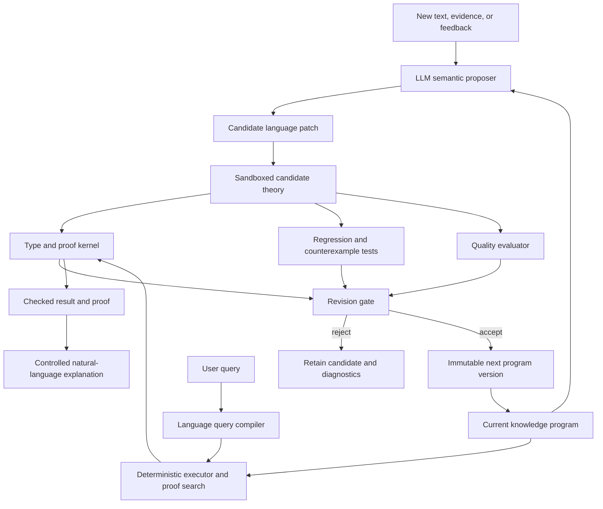

# A Self-Editing Language for Coherent Knowledge

## Status

Proposed research direction.

## Thesis

Build one small programming language in which knowledge, definitions, contexts,
quotations, and proofs are all native language constructs. Use an LLM as a semantic
proposer that translates its distributed statistical knowledge into candidate programs.
Allow the resulting knowledge program to revise its own definitions and theories as new
data arrives, but require every revision to pass a fixed trusted verifier before it can
become part of the next executable version.

The essential loop is:

```txt
current knowledge program
    + new language or evidence
    -> candidate program patches
    -> type checking, proof checking, and empirical testing
    -> deterministic patch selection
    -> next knowledge program
```

The trusted proof kernel does not rewrite itself. The knowledge expressed in the
language does.

The intended result is not an omniscient machine. It is an indefinitely extensible
body of executable knowledge with four unusually strong properties:

```txt
- every deductive conclusion is proof-checkable
- conflicting assertions can be represented without being jointly asserted
- every accepted revision is explicit and reversible
- repeated questions over the same version receive the same answers
```

---

## 1. What Is Being Built?

This project is a language and runtime for **semantic crystallization**.

An LLM contains a distributed statistical representation of language and much of the
knowledge expressed through language. The proposed system repeatedly converts useful,
stable parts of that representation into discrete code.

The model begins as both memory and reasoner:

```txt
question -> large numerical calculation -> generated answer
```

The desired end state is:

```txt
question -> compiled knowledge program -> checked result
```

The model remains useful for interpreting new language, inventing candidate
formalizations, discovering abstractions, and explaining checked results. It gradually
ceases to be the primary store of already-crystallized knowledge.

This is not a complete translation of neural weights. It is an incremental behavioral
extraction process:

```txt
interrogate the model
    -> identify stable distinctions and claims
    -> express them in one formal language
    -> attack them with counterexamples
    -> retain the fragments that survive
```

---

## 2. Design Goals

### 2.1 Primary goals

The language must:

1. Represent entities, concepts, relations, propositions, contexts, definitions,
   quotations, evidence, and proofs.
2. Give every accepted expression exact operational meaning.
3. Make deductive validity decidable to check, even when finding a proof is difficult.
4. Represent “source S claims P” without thereby asserting `P`.
5. Permit several incompatible definitions or theories to exist as named values.
6. Allow the knowledge program to propose revisions to its own code.
7. Apply revisions transactionally, producing immutable theory versions.
8. Calculate which definitions, theorems, and answers a revision changes.
9. Distinguish proof, evidence, hypothesis, report, and rejection.
10. Answer queries through proof construction rather than language-model improvisation.

### 2.2 Non-functional goals

| Property | Requirement |
|---|---|
| Determinism | A program version, query, and resource policy produce a reproducible result |
| Soundness | The trusted kernel accepts only well-typed proof terms constructed by its rules |
| Replayability | Every theory version and revision can be reconstructed exactly |
| Minimal trusted base | Models, search, scoring, and patch generation remain untrusted |
| Inspectability | Every result exposes its premises, definitions, context, and proof |
| Incrementality | Small revisions recheck only affected dependency regions when safe |
| Extensibility | New concepts and relations are ordinary programs, not kernel changes |
| Failure safety | Failed proof search returns `unknown`; it never becomes falsity or truth |
| Security | Quoted or imported code cannot execute or alter the verifier implicitly |
| Portability | The language has a formal specification independent of one LLM vendor |

### 2.3 Non-goals

The first language should not attempt to:

```txt
- reproduce every behavior of the source LLM
- store prose as though prose were formal knowledge
- decide every expressible proposition
- prove empirical observations without assumptions
- convert model confidence directly into truth
- allow the program to redefine what counts as a valid proof
- erase disputed or rejected claims from history
```

---

## 3. The One-Language Principle

The project should have one canonical language and one semantics.

It should not make a property graph the meaning layer, use fuzzy truth as a second
meaning layer, attach a different modal engine for obligations, and then serialize the
whole construction through configuration records. Those may become implementation
techniques, but none of them defines knowledge.

The canonical source program should be sufficient to state:

```txt
what objects exist
what expressions mean
what is being assumed
what a source said
what evidence supports
what follows
what changed
why a change was accepted
```

Search indexes, databases, caches, and optimized executors are compiler products. They
can be deleted and rebuilt from the knowledge program without changing its meaning.

---

## 4. Foundational Calculus

### 4.1 Recommended foundation

Use a small, total, dependently typed lambda calculus with:

```txt
- inductive data types
- functions and application
- a universe of propositions, Prop
- proof terms, Proof<P>
- parametric and dependent types
- terminating recursion
- stratified quotation, Quote<T>
- immutable theory and revision values
```

The “propositions as types, proofs as programs” interpretation makes theorem checking a
form of type checking:

```txt
proof p : Proof<P>
```

means that the term `p` certifies proposition `P` under its declared assumptions.

The core should be smaller than its standard library. English-specific notions such as
ownership, causation, permission, species, or marriage are library definitions—not
primitive features of the kernel.

### 4.2 Why a typed calculus?

A typed calculus can reject category mistakes before reasoning:

```txt
relation parent_of : Person -> Person -> Prop

parent_of(blue, Tuesday)
```

fails because neither argument is a `Person`.

Types alone do not prove factual truth, but they make the language's distinctions
explicit and prevent entire classes of malformed propositions.

### 4.3 Why totality?

Functions used by the kernel must terminate. Unrestricted general recursion would make
type checking and proof checking capable of diverging.

Potentially unbounded theorem search remains outside the kernel. Search may time out;
checking a proof it discovers must terminate.

### 4.4 Classical reasoning

The core need not silently assume every classical principle. A context may explicitly
import a classical axiom when required:

```txt
context ClassicalMathematics {
    assume excluded_middle : forall p: Prop. p or not p
}
```

This keeps dependencies visible while retaining one calculus. “Classical,” “legal,” or
“probabilistic” need not mean separate runtimes; they can be libraries of types,
relations, and rules expressed in the same language.

---

## 5. Core Kinds and Types

The following names are illustrative surface syntax, not commitments to their internal
encoding.

### 5.1 Entity

An `Entity` is a particular referent:

```txt
entity socrates : Person
entity earth : Planet
entity declaration_of_independence : Document
```

Entity identity is asserted explicitly. Similar names or embeddings never merge
entities automatically.

### 5.2 Concept

A `Concept` is a predicate over some domain. Surface syntax can make the common case
concise:

```txt
concept Animal : Entity
concept Mammal : Entity
concept Dog : Entity
```

Concept membership is a proposition:

```txt
Dog(fido)
Mammal(fido)
```

A concept may be defined rather than merely declared:

```txt
define Bachelor(x: Entity) : Prop :=
    Person(x)
    and Adult(x)
    and Male(x)
    and NeverMarried(x)
```

### 5.3 Relation

A `Relation` is a typed function returning a proposition:

```txt
relation owns : Person -> Asset -> Prop
relation located_in : Entity -> Place -> Prop
relation before : Event -> Event -> Prop
relation is_a : Concept -> Concept -> Prop
```

The ordinary function type is sufficient; `relation` is useful declarative syntax and
documentation.

### 5.4 Proposition

A `Prop` is something for which a proof may be requested:

```txt
Dog(fido)
forall x: Entity. Dog(x) -> Mammal(x)
not located_in(fido, chicago)
```

A proposition is not a floating truth value between zero and one. Uncertainty is
represented by evidence or probability claims *about* a proposition.

### 5.5 Context

A `Context` is a named theory containing definitions, premises, and derived theorems:

```txt
context Biology2026 {
    define ...
    premise ...
    theorem ...
}
```

Contexts can import other contexts explicitly:

```txt
context VeterinaryBiology2026 {
    import Biology2026
    import VeterinaryDefinitions2026
}
```

Import conflicts fail compilation unless the program supplies an explicit resolution.

### 5.6 Definition

A definition introduces an exact abbreviation or construction:

```txt
define Grandparent(x: Person, z: Person) : Prop :=
    exists y: Person.
        parent_of(x, y) and parent_of(y, z)
```

Expanding a definition must not add a new assumption. Pure definitions are therefore
conservative extensions: they add vocabulary without changing what was previously
provable in the old vocabulary.

### 5.7 Quotation

Quotation turns code into inert typed data:

```txt
`earth revolves_around sun`
```

has a type resembling:

```txt
Quote<Prop>
```

The quoted proposition is not evaluated or asserted.

### 5.8 Claim

A claim relates an agent or source to a quoted proposition:

```txt
claim source_17 says `whales are fish`
```

This establishes something like:

```txt
claims(source_17, `whales are fish`)
```

It does not establish:

```txt
whales are fish
```

This is how the program may refer to contradictions without asserting contradictions.

### 5.9 Evidence

Evidence is neither a proposition nor a proof of that proposition:

```txt
evidence specimen_42 supports `BlueWhale(specimen_42)`
evidence genome_analysis supports `Mammal(specimen_42)`
```

Evidence can be inspected by an adoption policy. Turning evidence into a premise is an
explicit revision, not an automatic logical rule.

### 5.10 Proof

A proof is a term checked against a proposition:

```txt
theorem dog_animal(x: Entity)
    given dx: Dog(x)
    : Animal(x)
{
    let mx = dog_mammal(x, dx)
    exact mammal_animal(x, mx)
}
```

Proof search may generate this code, but only the kernel decides whether it has the
declared type.

### 5.11 Revision

A `Revision` is a typed transformation between knowledge program versions:

```txt
revision split_bank
    from Knowledge@42
    to Knowledge@43
{
    ...
}
```

A revision is proposed and evaluated as data. It cannot commit itself merely by being
constructed.

---

## 6. Minimal Surface Language

### 6.1 Primitive declarations

The initial surface language should remain small:

```txt
type
entity
concept
relation
define
context
import
premise
evidence
claim
hypothesis
theorem
proof
quote
revision
test
query
```

### 6.2 Primitive logical operations

```txt
apply
equal
not
and
or
implies
forall
exists
assume
prove
```

Most syntax can be sugar over function application and typed terms.

### 6.3 Illustrative grammar

```txt
Program      ::= Declaration*

Declaration  ::= TypeDecl
               | EntityDecl
               | RelationDecl
               | Definition
               | ContextDecl
               | PremiseDecl
               | EvidenceDecl
               | ClaimDecl
               | TheoremDecl
               | RevisionDecl
               | TestDecl

Proposition  ::= RelationCall
               | Equal
               | Not
               | And
               | Or
               | Implies
               | Forall
               | Exists

Quotation    ::= "`" Expression "`"
```

The formal grammar and typing judgments must ultimately be much more precise. The goal
here is to establish the language's conceptual size.

---

## 7. Basic Example

```txt
context AnimalTaxonomy {
    type Entity

    concept Animal : Entity
    concept Mammal : Entity
    concept Dog : Entity

    entity fido : Entity

    premise fido_dog : Dog(fido)

    premise dog_mammal :
        forall x: Entity. Dog(x) -> Mammal(x)

    premise mammal_animal :
        forall x: Entity. Mammal(x) -> Animal(x)

    theorem fido_animal : Animal(fido) {
        let d = fido_dog
        let m = dog_mammal(fido, d)
        exact mammal_animal(fido, m)
    }
}
```

A query is evaluated inside an explicit context:

```txt
query AnimalTaxonomy |- Animal(fido)
```

Possible result:

```txt
PROVED Animal(fido)

using:
    fido_dog
    dog_mammal
    mammal_animal

proof:
    fido_animal
```

If neither the proposition nor its negation is derivable:

```txt
UNDETERMINED
```

Failure to find a proof within a resource limit is:

```txt
TIMEOUT
```

It is not equivalent to `UNDETERMINED`, and neither is equivalent to `REFUTED`.

---

## 8. Contextual and Disputed Definitions

The same spelling may resolve to different definitions in different contexts:

```txt
context Dictionary1900 {
    define Computer(x: Entity) : Prop :=
        Person(x) and PerformsCalculations(x)
}

context Computing2026 {
    define Computer(x: Entity) : Prop :=
        ElectronicDevice(x)
        and ExecutesStoredInstructions(x)
}
```

Neither definition overwrites the other. Code must name or inherit a context:

```txt
Dictionary1900::Computer(ada)
Computing2026::Computer(laptop)
```

The language may express relationships between the definitions:

```txt
theorem computer_senses_distinct :
    not equal(
        `Dictionary1900::Computer`,
        `Computing2026::Computer`
    )
```

Whether that theorem is provable depends on the formal equality selected for quoted
definitions. The important point is that difference is represented as code rather than
hidden inside prose.

---

## 9. Representing Contradiction Without Claiming It

Consider two sources:

```txt
context HistoricalReports {
    claim source_a says `Whale is_a Fish`
    claim source_b says `not(Whale is_a Fish)`
}
```

This context does not assert either object-level proposition. It asserts two compatible
meta-level propositions about what sources said.

An adopted biological theory may separately contain:

```txt
context ModernBiology {
    premise whale_mammal : Whale is_a Mammal
    premise mammal_not_fish :
        forall x: Concept. x is_a Mammal -> not(x is_a Fish)

    theorem whale_not_fish : not(Whale is_a Fish) {
        exact mammal_not_fish(Whale, whale_mammal)
    }
}
```

The atlas of assertions can contain contradictory references. Each executable theory
must state what it adopts.

### 9.1 No unrestricted unquote

The language must not contain a general rule resembling:

```txt
claims(source, `P`) -> P
```

That would turn every report into truth.

An adoption policy may create a scoped premise from evidence, but the act and its
dependencies must appear explicitly in the revised program.

---

## 10. Epistemic States

The language should distinguish at least these states:

### Theorem

```txt
theorem p : P { proof }
```

`P` follows from the context's premises and definitions.

### Premise

```txt
premise p : P
```

The context adopts `P` without deriving it inside that context. Premises must identify
their originating revision and support. A theorem prover cannot prove that an empirical
premise accurately describes reality.

### Hypothesis

```txt
hypothesis h : P
```

`P` is available only in explicitly hypothetical reasoning and is not part of the
accepted context.

### Evidence

```txt
evidence e supports `P`
```

`e` bears on `P` but is not a proof term for `P`.

### Claim

```txt
claim s says `P`
```

The source asserts `P`; the program does not.

### Rejected candidate

```txt
reject candidate_p because counterexample_17
```

The candidate remains inspectable and may be reconsidered if later revisions undermine
the rejection.

This separation prevents a single model-confidence number from masquerading as logical
or empirical validity.

---

## 11. Self-Revision Model

### 11.1 The central safety rule

The knowledge program may produce a proposed `Revision`. Only the external trusted
revision gate may publish that revision as the next program version.

```txt
self-inspection -> proposal -> sandbox -> verification -> commit
```

Never:

```txt
self-inspection -> direct mutation of running theory
```

### 11.2 Revision operations

A revision may propose to:

```txt
add or remove a premise
add a proven theorem
introduce or expand a definition
split or merge concepts
rename symbols while preserving identity
move a proposition into a narrower context
add a qualification or exception
replace a rule with a more accurate rule
demote a premise to a hypothesis
promote evidence into a scoped premise
invalidate and rebuild dependent proofs
```

### 11.3 Revision example: learning about penguins

Initial program:

```txt
context Birds@1 {
    premise all_birds_fly :
        forall x: Entity. Bird(x) -> Flies(x)

    premise pingu_is_bird : Bird(pingu)
}
```

New observations support:

```txt
Bird(pingu)
not Flies(pingu)
```

The system constructs the conflict:

```txt
all_birds_fly
pingu_is_bird
not Flies(pingu)
```

It may propose several patches:

```txt
candidate A: reject the new observation
candidate B: remove all_birds_fly
candidate C: add Penguin as an exception
candidate D: replace Flies with NormallyFlies
candidate E: refine the relevant biological conditions
```

A stronger patch could be:

```txt
revision qualify_bird_flight
    from Birds@1
    to Birds@2
{
    remove premise all_birds_fly

    concept FlightCapableBird : Entity

    define FlightCapableBird(x: Entity) : Prop :=
        Bird(x)
        and HasFunctionalFlightAnatomy(x)
        and not TemporarilyFlightImpaired(x)

    premise capable_birds_fly :
        forall x: Entity. FlightCapableBird(x) -> CanFly(x)

    add evidence penguin_observation supports `not CanFly(pingu)`
}
```

This is more than adding an exception. It improves the theory's vocabulary so that it
expresses the relevant distinction.

### 11.4 Revision example: splitting a concept

```txt
revision split_bank
    from EnglishKnowledge@42
    to EnglishKnowledge@43
{
    replace concept Bank with {
        concept FinancialBank
        concept RiverBank
    }

    migrate usage_101 to FinancialBank
    migrate usage_102 to RiverBank

    require all affected proofs rechecked
    require no unresolved Bank references
}
```

The exact patch syntax can change. The semantic requirements cannot: the transformation
must be explicit, dependency-aware, checked, and reversible.

---

## 12. Revision Validation

Every candidate revision is evaluated against a fixed sequence of gates.

### Gate 1: Parse and type check

The proposed program must be syntactically valid and well typed.

### Gate 2: Kernel check

Every new or changed theorem must have a valid proof. Definitions must pass termination,
positivity, and universe checks required by the calculus.

### Gate 3: Dependency reconstruction

All affected theorems, queries, definitions, and tests are identified. Every invalidated
artifact must be rebuilt or explicitly removed.

### Gate 4: Contradiction analysis

The candidate must not introduce a derivation of `False` into a context promised to be
consistent.

For expressive theories, failure to find a contradiction is not a proof of consistency.
The strongest admissible changes are therefore, in descending order:

```txt
1. checked theorems, which add no assumptions
2. conservative definitions
3. extensions accompanied by a checked model or consistency certificate
4. new scoped premises that pass bounded consistency analysis
5. explicitly provisional contexts with no absolute consistency claim
```

An expressive system cannot generally prove its own consistency. The language must
state the assurance level instead of concealing this limit.

### Gate 5: Semantic regression suite

The candidate runs against:

```txt
known examples
known counterexamples
minimal semantic pairs
previously answered queries
definition boundary cases
held-out observations
adversarially generated cases
```

### Gate 6: Quality comparison

The revision must improve or deliberately trade among declared quality measures.

### Gate 7: Transactional commit

The accepted candidate becomes a new immutable version. Failure at any gate leaves the
current program untouched.

---

## 13. What “Better Knowledge” Means

Consistency cannot be the only objective. The empty program is perfectly consistent.

A revision policy should compare candidate theories using multiple properties:

```txt
evidence fit
held-out predictive accuracy
coverage of accepted questions
proof coverage
definition discrimination
conceptual compression
number of unsupported premises
number of special-case exceptions
number of unresolved conflicts
revision size and semantic churn
```

A conceptual objective is:

```txt
quality(T, D) =
      evidence_fit(T, D)
    + heldout_accuracy(T, D)
    + proof_coverage(T)
    + compression(T)
    - unsupported_assumptions(T)
    - unexplained_exceptions(T)
    - complexity(T)
    - instability(T)
```

The exact weights are policy, not logic. They must be declared and versioned.

### 13.1 Hard invariants versus optimization targets

Some properties are mandatory:

```txt
kernel soundness
type safety
quotation isolation
version replayability
protected test preservation
```

Others are optimization targets:

```txt
coverage
simplicity
prediction
compression
stability
```

The system may trade among optimization targets. It may not trade away a hard invariant
to improve a score.

### 13.2 Avoiding coherence theater

A system could appear more coherent by deleting difficult facts, inventing narrow
contexts, or labeling every candidate uncertain. Required countermeasures include:

```txt
minimum coverage constraints
held-out evaluations
penalties for unnecessary context splitting
retention of rejected evidence
semantic-diff review
tests for vacuous definitions and theorems
```

Increasing coherence must mean explaining more evidence with better distinctions—not
hiding evidence that creates difficulty.

---

## 14. Reflection Without Paradox

Self-editing requires the program to inspect its own expressions. Unrestricted
self-reference would permit liar-like constructions and circular proof authorization.

### 14.1 Stratified quotation

Use levels:

```txt
Level 0: entities and ordinary propositions
Level 1: quoted Level 0 expressions, claims, and proofs about their syntax
Level 2: revisions and policies operating on Level 1 program values
```

A value may quote a lower-level expression. It may not freely convert a quotation at
its own level into an asserted proposition.

### 14.2 No universal truth predicate

Do not provide:

```txt
truth : Quote<Prop> -> Prop
```

with unrestricted reflection principles. Instead provide narrow checked operations:

```txt
typecheck : Quote<Term> -> CheckResult
dependencies : Quote<Term> -> Set<Symbol>
normalize : Quote<Term> -> Quote<Term>
verify_proof : Quote<Proof<P>> -> CheckResult
```

These analyze syntax and proof objects without allowing arbitrary quoted claims to
declare themselves true.

### 14.3 The kernel is outside ordinary revision

Kernel upgrades are software releases, not knowledge patches. A kernel change requires
independent verification and migration of the complete knowledge program.

This is the indispensable boundary:

```txt
knowledge may revise knowledge
knowledge may propose a kernel revision
knowledge may not authorize a kernel revision
```

---

## 15. The LLM’s Role

The LLM is an untrusted but powerful semantic compiler and theory editor.

### 15.1 Candidate extraction

Given text, it proposes:

```txt
entities
concepts
relations
definitions
propositions
quantifier scopes
context boundaries
claims and evidence links
```

### 15.2 Counterexample generation

Given a definition or rule, it searches for:

```txt
clear false positives
clear false negatives
edge cases
scope ambiguities
hidden assumptions
historical counterexamples
alternative senses
```

### 15.3 Theory repair

Given a minimal conflict or failed test, it proposes:

```txt
retractions
qualifications
concept splits
new abstractions
exceptions
context changes
replacement proofs
```

### 15.4 Explanation

Given a checked proof or revision, it translates the formal artifact back into ordinary
language. The explanation must remain linked to the artifact and cannot add unsupported
conclusions.

### 15.5 What the LLM does not control

It does not decide:

```txt
whether a proof is valid
whether code is well typed
whether a revision commits
whether a quotation becomes a premise
whether the trusted kernel changes
```

---

## 16. Architecture



### 16.1 Trusted computing base

The smallest trusted base consists of:

```txt
parser
elaborator and type checker
normalizer
proof checker
quotation-level checker
revision transaction verifier
canonical serializer and hash implementation
```

The LLM, theorem search, quality scoring, indexes, and explanation generator are
untrusted.

### 16.2 One semantics, multiple execution strategies

The implementation may compile proven-safe fragments into indexes, lookup tables, or
specialized query plans. Those are optimizations of one language, analogous to machine
code generated from a source language.

An optimization is acceptable only if its behavior is equivalent to the canonical
semantics or if its result is checked by the kernel afterward.

---

## 17. Query Semantics

A query asks for the status of a proposition in a named program version and context:

```txt
query Knowledge@43::ModernBiology |- Mammal(blue_whale)
```

Results should be discrete:

```txt
PROVED         proof of P accepted
REFUTED        proof of not P accepted
BOTH           both are derivable in a context not promised consistent
UNDETERMINED   neither is derivable
TIMEOUT        search ended before a conclusion
ILL_TYPED      query is not a meaningful proposition
INVALID        purported proof or program failed checking
```

Every positive or negative conclusion returns:

```txt
program version
context
normalized proposition
proof object
premise dependency set
definition dependency set
revision lineage
```

Natural-language answers are projections of this result, not independent generations.

---

## 18. Definitions as Executable Code

Definitions are central because they control which inferences the program can make.

### 18.1 Exact definition

```txt
define Even(n: Natural) : Prop :=
    exists k: Natural. n = 2 * k
```

### 18.2 Partial definition

Some human concepts cannot honestly be reduced to necessary and sufficient conditions.
The language should permit a concept to remain primitive while accumulating proved
relations and tests:

```txt
concept Game : Activity

example chess : Game(chess)
example soccer : Game(soccer)
counterexample taxation : not Game(taxation)

hypothesis competitive_games:
    forall x. Game(x) -> MayInvolveCompetition(x)
```

The system should not fabricate an exact definition merely to make the entry look
complete.

### 18.3 Definition tests

```txt
test bachelor_includes_alex {
    assume Person(alex)
    assume Adult(alex)
    assume Male(alex)
    assume NeverMarried(alex)
    prove Bachelor(alex)
}

test bachelor_excludes_married_person {
    assume Person(sam)
    assume Adult(sam)
    assume Male(sam)
    assume Married(sam)
    prove not Bachelor(sam)
}
```

The second test requires an explicit relationship between `Married` and
`NeverMarried`; the language will expose if that supposedly obvious relationship was
never defined.

### 18.4 Definition impact

When a definition changes, the compiler constructs a semantic dependency graph and
reports:

```txt
theorems no longer proved
newly provable theorems
queries whose answers changed
examples whose classifications changed
downstream definitions requiring review
```

Definition evolution becomes program maintenance rather than silent semantic drift.

---

## 19. Consistency and Its Exact Limit

The language can guarantee that accepted proof terms obey its inference rules. It
cannot, from inside a sufficiently expressive theory, generally guarantee that every
set of premises is consistent or that every premise is true.

This produces three assurance levels.

### Level 1: Kernel soundness

Every theorem has a valid proof relative to declared premises. This is the foundational
guarantee.

### Level 2: Consistency-preserving construction

The theory grows through checked theorems and conservative definitions. These do not
introduce new assumptions.

### Level 3: Empirical theory revision

New observations may require new premises. These are tested for known contradictions,
predictive accuracy, and evidence support, but their factual truth remains revisable.

The honest promise is therefore:

> The program never presents an invalid derivation as a proof, and it never conceals
> which adopted premises a conclusion depends upon.

That is stronger and more useful than claiming metaphysical certainty.

---

## 20. Efficiency Model

Extraction may be extremely expensive. The expected benefit is amortized execution.

### Before compilation

```txt
every question
    -> run a large model
    -> reconstruct relevant distinctions
    -> regenerate reasoning
    -> generate prose
```

### After compilation

```txt
first encounter
    -> expensive semantic crystallization

later encounters
    -> symbol lookup
    -> indexed rule selection
    -> cached normalization or proof reuse
    -> checked answer
```

The compiled program should be faster for stable, repeated, formally covered queries.
It is not guaranteed to be faster for novel open-ended questions or difficult theorem
search.

Performance optimizations include:

```txt
proof memoization
dependency-indexed incremental checking
normalized term hashing
compiled pattern indexes
precomputed theorem closure for bounded fragments
dead-definition and redundant-premise elimination
specialized execution of common total functions
```

All caches remain derived from the canonical program.

---

## 21. Security and Failure Modes

| Failure | Consequence | Required response |
|---|---|---|
| Model emits plausible but wrong code | Wrong candidate theory | Keep model untrusted; require checking and tests |
| Valid proof formalizes the wrong sentence | False semantic confidence | Contrastive tests, paraphrase checking, source alignment |
| New premise introduces hidden inconsistency | Unsound context | Prefer conservative changes; isolate premise; seek model/counterexample |
| System improves score by deleting knowledge | Coherence theater | Coverage floors, held-out tests, retained evidence |
| System over-splits contexts | Every conflict becomes vacuously isolated | Complexity penalty and context-necessity tests |
| Quoted code escapes into execution | Claims become assertions | Stratified quotation and no general unquote |
| Revision damages many theorems | Semantic regression | Dependency impact report and protected proof suite |
| Theorem search times out | Missing answer | Return `TIMEOUT`, retain proof obligation |
| Optimized backend disagrees with semantics | Incorrect fast result | Certificate checking or differential execution |
| Program proposes weaker verifier | Self-authorization attack | Kernel outside ordinary revision authority |
| Evidence is duplicated and treated as independent | Inflated support | Evidence lineage and dependency detection |
| Self-generated data validates itself | Epistemic feedback loop | Separate generated, observed, and independent evidence |

---

## 22. Architectural Decisions

### ADR-001: Use one canonical typed calculus

**Status:** Proposed.

**Context:** The knowledge representation needs exact semantics while remaining able to
represent ordinary relations, definitions, contexts, and meta-level claims.

**Decision:** Use one small dependently typed, total calculus with propositions as types
and stratified quotation.

**Consequences:** The language has one source of semantic truth and a small verifier.
Designing a pleasant surface syntax and usable automation will be difficult.

**Alternatives considered:** A collection of graphs, probabilistic logics, rule engines,
and serialized records would be faster to assemble but would lack one authoritative
meaning.

### ADR-002: Distinguish proposition, quotation, evidence, and proof

**Status:** Proposed.

**Context:** Human sources and models contain conflicting claims. Treating every
extracted sentence as an assertion makes global consistency impossible.

**Decision:** Give `Prop`, `Quote<Prop>`, `Evidence<P>`, and `Proof<P>` different types,
with no implicit conversions among them.

**Consequences:** Contradictory reports can coexist safely. Promotion from evidence to a
premise becomes explicit and sometimes cumbersome.

**Alternatives considered:** A confidence score on every claim is simpler but conflates
linguistic uncertainty, evidence, probability, and validity.

### ADR-003: Permit self-revision only through checked patches

**Status:** Proposed.

**Context:** The knowledge program must improve itself without acquiring the power to
silently weaken its invariants.

**Decision:** Self-editing produces immutable candidate revisions evaluated by an
external trusted gate. Running code never mutates the accepted theory in place.

**Consequences:** Every revision is reproducible and reversible. Improvement is slower
than unconstrained online mutation.

**Alternatives considered:** Direct self-modification is simpler but makes failures,
rollback, and proof dependencies unmanageable.

### ADR-004: Keep the kernel outside the knowledge revision system

**Status:** Proposed.

**Context:** A program that may redefine proof validity can approve arbitrary results.

**Decision:** Knowledge may propose but cannot authorize kernel changes.

**Consequences:** The trusted base remains meaningful. Kernel evolution requires a
separate software release and full migration process.

**Alternatives considered:** A fully reflective self-rewriting verifier is more
autonomous but destroys the stable standard by which improvement is measured.

### ADR-005: Prefer conservative extension

**Status:** Proposed.

**Context:** Arbitrary new premises can introduce inconsistency, while definitions and
proved theorems need not.

**Decision:** Prioritize revisions that add conservative definitions and checked
theorems. Treat premise changes as higher-risk empirical revisions.

**Consequences:** The core can grow safely, but factual correction requires explicit
belief revision rather than simple accumulation.

**Alternatives considered:** Accept every high-confidence model output as an axiom. This
would produce rapid coverage but no defensible consistency guarantee.

### ADR-006: Optimize coherence subject to coverage

**Status:** Proposed.

**Context:** Consistency alone favors empty or artificially fragmented theories.

**Decision:** Require coverage, held-out accuracy, and retained evidence while rewarding
proof coverage, compression, and consistency.

**Consequences:** Revision selection better approximates knowledge improvement. The
quality policy remains a contestable component that must be versioned.

### ADR-007: Preserve every accepted version

**Status:** Proposed.

**Context:** Definition changes can alter large regions of derived knowledge.

**Decision:** Knowledge versions are immutable, content-addressed programs connected by
explicit revision objects.

**Consequences:** Every old answer can be reproduced. Storage and migration management
become ongoing operational costs.

### ADR-008: Treat fast executors as verified compiler outputs

**Status:** Proposed.

**Context:** A small canonical calculus may not be the fastest representation for every
query pattern.

**Decision:** Permit optimized derived executors without giving them independent
semantics. Check their outputs or verify their compilation.

**Consequences:** The system can become efficient without becoming a semantic
hodgepodge. Compiler correctness becomes a substantial engineering obligation.

---

## 23. Development Plan

### Phase 0: Semantic core specification

Write formal judgments for:

```txt
parsing
typing
evaluation
proof checking
quotation levels
context imports
revision validity
canonical serialization
```

Prove basic properties such as determinism of normalization, type preservation, and
quotation isolation.

### Phase 1: Minimal interpreter and proof kernel

Implement:

```txt
types and total functions
Prop and proof terms
definitions
quantifiers and equality
contexts and imports
theorem checking
REPL queries
```

The implementation should be deliberately small and auditable.

### Phase 2: Claims, quotation, and evidence

Add:

```txt
Quote<T>
claim
evidence
hypothesis
premise lineage
stratification checks
```

Demonstrate that opposing source claims do not imply an object-level contradiction.

### Phase 3: Versioned self-revision

Implement:

```txt
immutable program snapshots
typed revisions
dependency impact analysis
sandboxed candidate evaluation
transactional commit and rollback
semantic regression tests
```

### Phase 4: LLM crystallizer

Use an LLM to propose language code from bounded natural-language material. Evaluate:

```txt
formalization accuracy
paraphrase stability
counterexample discovery
definition quality
repair quality
percentage of proposals accepted unchanged
```

### Phase 5: Autonomous theory maintenance

Allow the system to propose and automatically commit low-risk changes:

```txt
proved theorems
conservative definitions
redundancy removal
proof refactoring
safe symbol normalization
```

Premise revision and concept restructuring require stronger evaluation gates.

### Phase 6: Continual knowledge crystallization

Run the full loop continuously:

```txt
new data
    -> candidate knowledge
    -> conflict and novelty analysis
    -> theory patches
    -> proof and empirical evaluation
    -> accepted version
```

Measure whether the discrete program progressively answers more questions without the
source model while maintaining or improving accuracy.

---

## 24. First Prototype

The first prototype should prove the self-revision thesis, not attempt broad English.

Use a compact taxonomy and ordinary-knowledge domain containing:

```txt
50 concepts
20 relations
100 premises
50 source claims
25 definitions
50 theorems
contradictory and obsolete reports
held-out examples
```

The demonstration should show:

1. The LLM translates prose into candidate language code.
2. The kernel rejects an ill-typed or invalid candidate.
3. Conflicting reports coexist through quotation.
4. New evidence breaks an overgeneral rule.
5. The system proposes several repairs.
6. A concept split or refined definition wins the declared evaluation.
7. Dependent proofs are rebuilt.
8. The new version answers the changed questions deterministically.
9. The old version reproduces its original results exactly.
10. Compiled queries no longer require the LLM.

The crucial metric is not how many sentences were ingested. It is whether a semantic
revision produces a demonstrably better executable theory without weakening the proof
contract.

---

## 25. Research Questions

The project should treat these as its core unknowns:

1. What is the smallest calculus expressive enough for human definitions without making
   proof checking or reflection unsafe?
2. Which knowledge transformations can be proved conservative automatically?
3. How should empirical support be represented without turning it into fuzzy truth?
4. Can LLMs reliably generate useful concept splits and definition repairs from minimal
   conflict sets?
5. Which quality objective causes genuine explanatory improvement rather than deletion,
   fragmentation, or overfitting?
6. How much of a model's behavior can be replaced by the growing discrete program?
7. Does knowledge compilation produce real runtime and energy savings after extraction
   cost is amortized?
8. Can natural-language explanations be constrained to say exactly what the proof
   establishes?
9. How stable are learned concepts across different source models and corpora?
10. Can the system discover better primitives rather than merely accumulating rules in
    a fixed ontology?

---

## 26. Final Position

The most coherent form of this project is one self-describing knowledge language with a
small non-self-authorizing proof kernel.

Its long-term operation is:

```txt
statistical knowledge proposes
formal knowledge records
counterexamples challenge
theories revise
proofs constrain
versions preserve
execution answers
```

The LLM contributes semantic breadth and creative hypothesis generation. The language
contributes exact distinctions and reusable structure. The proof kernel contributes an
unchanging standard of deductive validity. The revision system turns new evidence and
contradictions into pressure for better definitions rather than into silent confusion.

The system cannot guarantee that every empirical premise is true, that its theory is
complete, or that a final perfect body of knowledge exists. It can aim for something
concrete and progressively measurable:

> Each accepted program version should explain at least as much independent evidence,
> preserve or improve held-out accuracy, contain better-factored definitions, support
> more checked conclusions, and disclose every assumption on which those conclusions
> depend.

That is a plausible mechanism for moving from a large statistical approximation of
human discourse toward an increasingly coherent, discrete, executable body of
knowledge.
