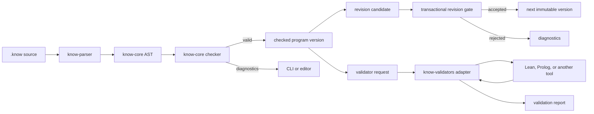

# Framework Architecture

## Requirements

### Functional

- Parse one canonical `.know` language.
- Check symbol identity, relation signatures, proposition types, quotation boundaries,
  and proof terms in Rust.
- Keep claims and evidence unavailable to proofs unless a later explicit revision
  promotes them to premises.
- Apply knowledge revisions transactionally and reject invalid candidate versions.
- Permit external tools to test claims without granting them mutation or proof-checking
  authority.
- Provide deterministic command-line checks suitable for local use and CI.

### Non-functional

- No `unsafe` Rust.
- No network access from the core checker.
- Deterministic diagnostics for identical source and tool versions.
- A failed parse, proof, validator, or revision leaves the accepted program unchanged.
- External validators are opt-in child processes and must be sandboxed by their caller
  when processing hostile claims.
- Canonical checks should remain fast enough to run on every edit; expensive theorem
  search belongs outside the kernel.

## Components

## Trust boundary

The Rust core checker is authoritative for the V0 language's structural types and proof
terms. The parser, CLI, theorem search, LLM, and external validators can all produce
candidate artifacts, but they cannot cause an invalid artifact to be accepted by the
checker.

An external validator result is evidence about a claim. It is not silently converted
into a core proof. A later design may support validator certificates that the Rust
kernel can independently check.

## Failure modes

| Failure | Result |
|---|---|
| Malformed source | Parse error with source span; no AST accepted |
| Ill-typed relation call | Checker diagnostic; program rejected |
| Claim used as proof | Unknown proof diagnostic; program rejected |
| Invalid modus ponens | Proof diagnostic; theorem rejected |
| Revision parent mismatch | Revision rejected without mutation |
| Revision breaks a prior theorem | Candidate version rejected |
| Validator unavailable | Adapter error; core program unaffected |
| Validator returns malformed output | Protocol error; core program unaffected |
| Validator claims validity incorrectly | Report remains untrusted evidence |

## Near-term evolution

1. Stabilize V0 parsing, spans, diagnostics, and proof checking.
2. Add variables, binders, universal and existential quantification.
3. Add exact definitions and reduction.
4. Add context imports with explicit conflict handling.
5. Define textual revision syntax and canonical program serialization.
6. Add certificate-producing Lean integration before accepting any external proof as a
   core proof.
